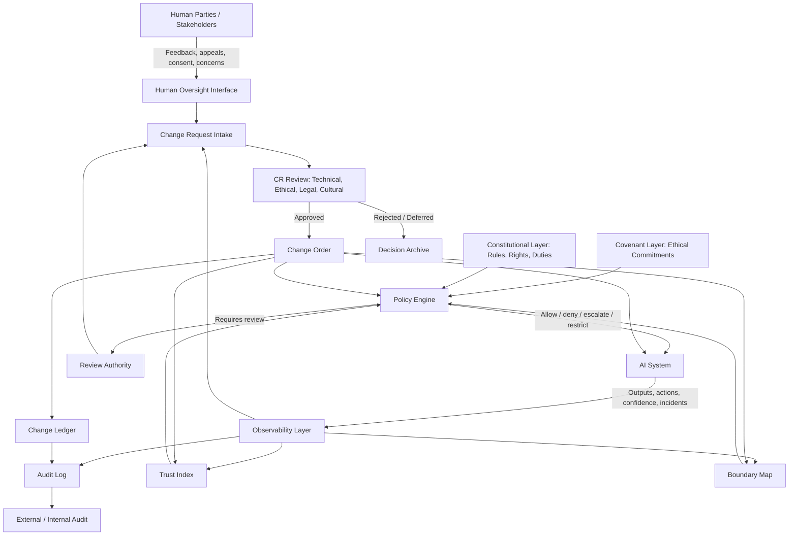

# Architecture Diagram

## Component Summary

### Human Oversight Interface
Receives stakeholder input, appeals, consent signals, harm reports, and requests for boundary review.

### Observability Layer
Collects system behavior data: outputs, tool calls, confidence estimates, failure modes, and incident signals.

### Trust Index
Quantifies earned trust using reliability, transparency, audit history, incident frequency, and compliance performance.

### Boundary Map
Defines the current operating limits of the AI system. The boundary does not disappear; it moves based on evidence, context, and governance.

### Constitutional Layer
The enforceable layer: rules, duties, rights, remedies, jurisdiction, accountability, and escalation paths.

### Covenant Layer
The interpretive layer: dignity, stewardship, fairness, human welfare, cultural legitimacy, and higher-order ethical commitments.

### Policy Engine
Applies rules and constraints. It may permit, deny, restrict, escalate, or require human review.

### Review Authority
A governance body or process that reviews high-impact actions and proposed system changes.

### Change Request / Change Order System
Formal construction-style process for proposing, reviewing, approving, documenting, and enforcing changes.

### Change Ledger
Version-controlled record of all approved changes, rejected changes, emergency interventions, and boundary shifts.
